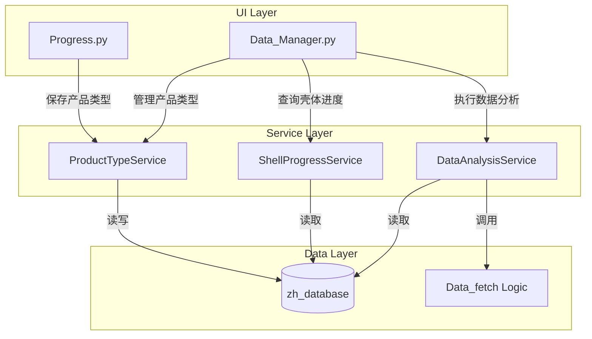

# Design Document: Data Manager (Zh's DataBase)

## Overview

Data Manager 是一个三层数据管理与分析系统，用于管理从 Progress 页面保存的产品数据，并提供壳体进度可视化和多站别数据分析功能。

### 核心功能
1. **第一层 - 产品类型管理**：管理产品类型、生产订单、附件
2. **第二层 - 壳体进度分析**：甘特图展示壳体进度
3. **第三层 - 数据分析**：调用 Data_fetch 逻辑进行多站别分析

### 数据流
```
Progress.py → 保存 → ProductType → 选择订单 → 壳体进度(甘特图) → 数据分析(Data_fetch)
```

## Architecture



## Components and Interfaces

### 1. ProductTypeService

负责产品类型的 CRUD 操作和附件管理。

```python
class ProductTypeService:
    """产品类型服务"""
    
    def __init__(self, database_dir: Path):
        self.database_dir = database_dir
        self.metadata_file = database_dir / "product_types.json"
    
    def save_product_type(
        self,
        name: str,
        shells_df: pd.DataFrame,
        production_orders: List[str],
        source_file: Optional[str] = None
    ) -> str:
        """
        保存产品类型
        
        Args:
            name: 产品类型名称 (如 M20-AM-C)
            shells_df: 壳体数据 DataFrame
            production_orders: 生产订单列表
            source_file: 来源文件名
            
        Returns:
            产品类型 ID
        """
        pass
    
    def get_product_type(self, product_type_id: str) -> Optional[ProductType]:
        """获取产品类型详情"""
        pass
    
    def list_product_types(self) -> List[ProductTypeSummary]:
        """列出所有产品类型"""
        pass
    
    def rename_product_type(self, product_type_id: str, new_name: str) -> bool:
        """重命名产品类型"""
        pass
    
    def delete_product_type(self, product_type_id: str) -> bool:
        """删除产品类型（级联删除关联数据）"""
        pass
    
    def get_production_orders(self, product_type_id: str) -> List[ProductionOrder]:
        """获取产品类型下的生产订单列表"""
        pass
    
    # 附件管理
    def upload_attachment(
        self,
        product_type_id: str,
        file: UploadedFile,
        file_type: str  # 'pdf' or 'excel'
    ) -> str:
        """上传附件"""
        pass
    
    def list_attachments(self, product_type_id: str) -> List[Attachment]:
        """列出产品类型的附件"""
        pass
    
    def delete_attachment(self, product_type_id: str, attachment_id: str) -> bool:
        """删除附件"""
        pass
```

### 2. ShellProgressService

负责壳体进度查询和甘特图数据生成。

```python
class ShellProgressService:
    """壳体进度服务"""
    
    def __init__(self, database_dir: Path):
        self.database_dir = database_dir
    
    def get_shells_by_orders(
        self,
        product_type_id: str,
        order_ids: List[str],
        time_filter: Optional[datetime] = None
    ) -> pd.DataFrame:
        """
        根据生产订单获取壳体数据
        
        Args:
            product_type_id: 产品类型 ID
            order_ids: 生产订单 ID 列表（支持多选）
            time_filter: 时间筛选（默认最新）
            
        Returns:
            壳体数据 DataFrame，包含壳体号、最新站别、站别时间等
        """
        pass
    
    def generate_gantt_data(
        self,
        shells_df: pd.DataFrame,
        stations: List[str]
    ) -> List[Dict]:
        """
        生成甘特图数据
        
        Args:
            shells_df: 壳体数据
            stations: 站别顺序列表
            
        Returns:
            甘特图数据列表，每个元素包含壳体号、站别、开始时间、结束时间
        """
        pass
    
    def get_shell_detail(
        self,
        product_type_id: str,
        shell_id: str
    ) -> Optional[ShellDetail]:
        """获取壳体详情"""
        pass
```

### 3. DataAnalysisService

负责调用 Data_fetch 逻辑进行数据分析。

```python
class DataAnalysisService:
    """数据分析服务"""
    
    def __init__(self, database_dir: Path):
        self.database_dir = database_dir
    
    def fetch_test_data(
        self,
        shell_ids: List[str],
        test_types: Optional[List[str]] = None
    ) -> pd.DataFrame:
        """
        获取壳体测试数据（调用 Data_fetch 逻辑）
        
        Args:
            shell_ids: 壳体号列表
            test_types: 测试类型列表（如 LVI, Rth）
            
        Returns:
            测试数据 DataFrame
        """
        pass
    
    def apply_thresholds(
        self,
        df: pd.DataFrame,
        thresholds: Dict[str, Tuple[Optional[float], Optional[float]]]
    ) -> Tuple[pd.DataFrame, pd.DataFrame, Dict]:
        """
        应用阈值筛选
        
        Args:
            df: 数据 DataFrame
            thresholds: 阈值字典 {列名: (最小值, 最大值)}
            
        Returns:
            (合格数据, 不合格数据, 统计信息)
        """
        pass
    
    def save_threshold_config(
        self,
        product_type_id: str,
        thresholds: Dict[str, Tuple[Optional[float], Optional[float]]]
    ) -> bool:
        """保存阈值配置"""
        pass
    
    def load_threshold_config(
        self,
        product_type_id: str
    ) -> Optional[Dict[str, Tuple[Optional[float], Optional[float]]]]:
        """加载阈值配置"""
        pass
```

## Data Models

### ProductType

```python
@dataclass
class ProductType:
    """产品类型"""
    id: str                          # UUID
    name: str                        # 产品类型名称，如 M20-AM-C
    created_at: datetime
    updated_at: datetime
    source_file: Optional[str]       # 来源文件名
    shell_count: int                 # 壳体数量
    order_count: int                 # 订单数量
    attachments: List[str]           # 附件 ID 列表
    threshold_config: Optional[Dict] # 阈值配置
```

### ProductionOrder

```python
@dataclass
class ProductionOrder:
    """生产订单"""
    id: str                          # 订单号，如 WO-MP-M20-HX-25090251
    product_type_id: str             # 关联的产品类型 ID
    shell_count: int                 # 壳体数量
    latest_time: datetime            # 最新时间
    earliest_time: datetime          # 最早时间
```

### ShellProgress

```python
@dataclass
class ShellProgress:
    """壳体进度"""
    shell_id: str                    # 壳体号
    production_order: str            # 生产订单
    current_station: str             # 当前站别
    completed_stations: List[str]    # 已完成站别
    station_times: Dict[str, datetime]  # 站别时间映射
    is_engineering_analysis: bool    # 是否工程分析
```

### Attachment

```python
@dataclass
class Attachment:
    """附件"""
    id: str                          # UUID
    product_type_id: str             # 关联的产品类型 ID
    original_name: str               # 原始文件名
    stored_name: str                 # 存储文件名
    file_type: str                   # 文件类型 (pdf/excel)
    size: int                        # 文件大小（字节）
    uploaded_at: datetime
```

### 数据库文件结构

```
data/zh_database/
├── product_types.json              # 产品类型元数据
├── attachments/                    # 附件目录
│   ├── {uuid}.pdf
│   └── {uuid}.xlsx
└── shells/                         # 壳体数据目录
    └── {product_type_id}.parquet   # 壳体数据（Parquet 格式）
```

## Correctness Properties

*A property is a characteristic or behavior that should hold true across all valid executions of a system-essentially, a formal statement about what the system should do. Properties serve as the bridge between human-readable specifications and machine-verifiable correctness guarantees.*

### Property 1: Product Type Data Round-Trip
*For any* valid product type with shell data and production orders, saving to the database and then loading should produce equivalent data (same name, same shell count, same orders).
**Validates: Requirements 1.2, 7.1, 7.2**

### Property 2: Product Type Rename Preserves Data
*For any* product type with associated shells and orders, renaming the product type should preserve all associated data (shell count, order count, attachments remain unchanged).
**Validates: Requirements 1.5**

### Property 3: Production Orders Retrieval
*For any* product type with N production orders, calling `get_production_orders` should return exactly N orders, each with valid time information.
**Validates: Requirements 1.3, 3.3**

### Property 4: Default Time Selection
*For any* product type with multiple time records, when no time filter is specified, the system should select the most recent time record.
**Validates: Requirements 3.4**

### Property 5: Multi-Order Shell Aggregation
*For any* set of selected production orders, the resulting shell list should contain all shells from all selected orders without duplicates.
**Validates: Requirements 3.5**

### Property 6: Attachment Lifecycle
*For any* uploaded attachment, the file should exist in the filesystem and be associated with the product type; after deletion, both the file and association should be removed.
**Validates: Requirements 2.2, 2.5**

### Property 7: Shell Progress Retrieval
*For any* production order with N shells, querying shells by that order should return exactly N shells, each with current station information.
**Validates: Requirements 4.1**

### Property 8: Gantt Chart Station Ordering
*For any* shell progress data, the generated Gantt chart data should have stations ordered according to the process flow sequence.
**Validates: Requirements 4.3**

### Property 9: Threshold Filtering Partition
*For any* dataset and threshold configuration, applying thresholds should partition the data into two disjoint sets (pass and fail) where pass + fail = total.
**Validates: Requirements 6.2, 6.3**

### Property 10: Pass Rate Calculation
*For any* threshold filtering result, the pass rate should equal (pass count / total count) * 100, and the sum of pass and fail counts should equal total count.
**Validates: Requirements 6.4**

### Property 11: Threshold Config Persistence
*For any* saved threshold configuration, loading it for the same product type should return the same configuration.
**Validates: Requirements 6.5**

### Property 12: Cascading Delete
*For any* product type deletion, all associated shell data files and attachment files should be removed from the filesystem.
**Validates: Requirements 7.5**

## Error Handling

### 文件操作错误
- 文件不存在：返回 `FileNotFoundError` 并记录日志
- 文件损坏：捕获解析异常，提示用户删除损坏数据
- 磁盘空间不足：捕获 `IOError`，提示用户清理空间

### 数据验证错误
- 产品类型名称为空：拒绝保存，提示输入名称
- 重复的产品类型名称：提示用户修改名称或覆盖
- 无效的阈值范围（最小值 > 最大值）：自动交换或提示用户

### Data_fetch 集成错误
- 壳体测试数据不存在：返回空 DataFrame，在 UI 显示提示
- 数据提取超时：设置超时限制，提示用户稍后重试

## Testing Strategy

### 测试框架
- 单元测试：pytest
- 属性测试：hypothesis

### 单元测试
- 测试各 Service 类的基本 CRUD 操作
- 测试数据模型的序列化/反序列化
- 测试阈值筛选逻辑的边界情况

### 属性测试
- 使用 hypothesis 库进行属性测试
- 每个属性测试运行至少 100 次迭代
- 测试文件使用 `test_*.py` 命名，放在 `tests/` 目录
- 每个属性测试必须标注对应的 correctness property

### 测试标注格式
```python
# **Feature: data-manager, Property 1: Product Type Data Round-Trip**
# **Validates: Requirements 1.2, 7.1, 7.2**
@given(...)
def test_product_type_round_trip(...):
    ...
```

### 集成测试
- 测试 Progress.py 到 Data_Manager.py 的数据流
- 测试 Data_fetch 逻辑的集成调用
- 测试甘特图数据生成的正确性
